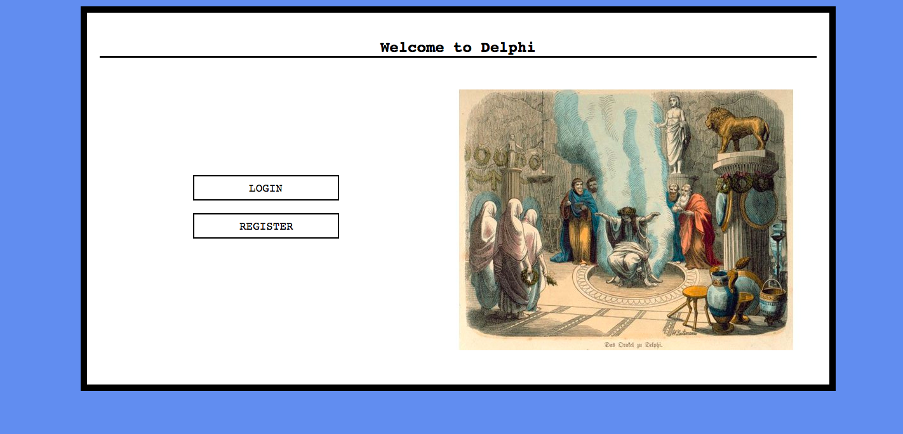
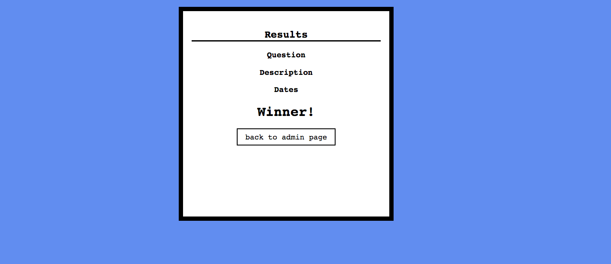

# Delphi App

Delphi is a full stack web application built with Node and Express which allows users (admins) create poll to be voted for a list of people, which will decide the admin to make a decision about a specifc topic.
It uses ranking points, ........
When an admin creates a poll, it sends email for a list of people..

## Final Product

* **Welcome Page**

<!-- * **Admin's Page** -->

* **Creating Polls**

<!-- * **Vote's Page** -->

<!--  -->

* **Result Page**

## Dependencies
* body-parser
* cookie-session
* cookie-parser
* ejs
* express
* "dotenv": "^2.0.0",
* "install": "^0.12.2",
* knex
* knex-logger
* knex-migrate
* mailgun-js
* morgan
* node-sass-middleware
* pg

** It is necessary to have a PostgreSQL database and a user to the MailGun running.

## Getting started
- `git clone git@github.com:tonykieling/decision-maker.git delphi`
- All dependencies will be installed using the command `npm install`
- Run migrations: `npm run knex migrate:latest`
- Run the seed: `npm run knex seed:run`
  - It will set an admin user: first@user.com password: 123456
  - Just use it to create polls and browser inside the Delphi App.
- Run the server: `npm run local`
- Visit `http://localhost:8080/`

## Improvements
- Add options and emails, create poll task, dynamically
- Allow the admin set time to poll expiration
- Send email to the admin when a voter votes
